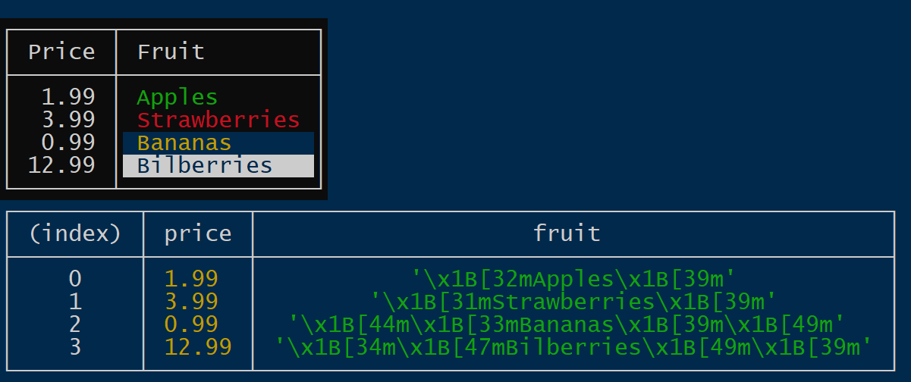

# table-string

Originally, I was looking for a replacement for `console.table()` because I missed this function in Cloudflare workers.

So table-string is a function originally inspired by `console.table()` but with the following main differences:

* First, it doesn't output anything to the console, but returns a string.
* More importantly its output looks less technical. It is aimed at simplifying the creation of meaningful tables for CLIs. 

## Geared for CLI output, not debugging

While I was looking into it, I realized that the output of `console.table()` looks rather technical. It's more appropriate for developers debugging their code than for users of a CLI that expect informative tables.

### Less technical

I intentionally left out some features of `console.table()` because they give the output a more technical, debugger-like look:  
 * there is no coloring of values based on their JavaScript type
 * there are no quotes around strings or 'm's after BigInts
 * null values and values of type "function" are not rendered
 * for arrays, the index column is only included if explicitly specified
 * the index column has no header by default 
 
 ### More functionality

 * It provides full control over table headings and alignment.
 * It is compatible with ANSI color sequences. For example, you can use the chalk package to color strings without affecting the layout. Even better: padding recognizes background colors and extends them. You can even define a chalk for the frame of the table.   

 ## Examples

 The picture below shows the `node.js` output of `console.log(tableString(data, [{ price: "Price" }, { fruit: "Fruit" }], {alignTableHeadings: "left", frameChalk: chalk.white.bgBlack(" ")}))`(upper table) and `console.table(data)` (lower table).

  

Data is defined as 
```
[
  { price: 1.99, fruit: chalk.green("Apples") },
  { price: 3.99, fruit: chalk.red("Strawberries") },
  { price: 0.99, fruit: chalk.bgBlue.yellow("Bananas") },
  { price: 12.99, fruit: chalk.blue.bgWhite("Bilberries") },
]
```
The additional parameters in the call to `tableString()` control the column headers and the colors of the frame.

