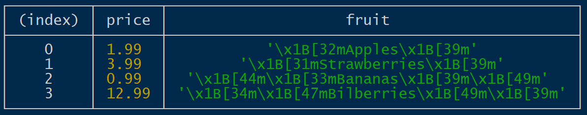
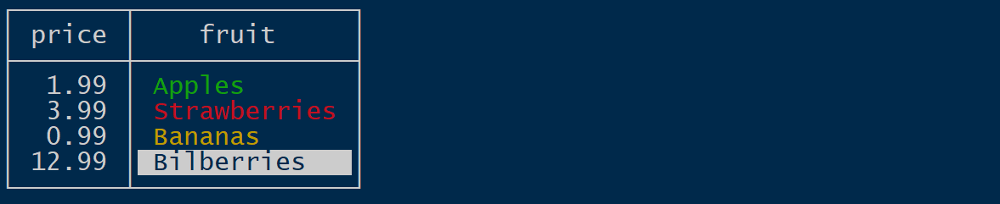
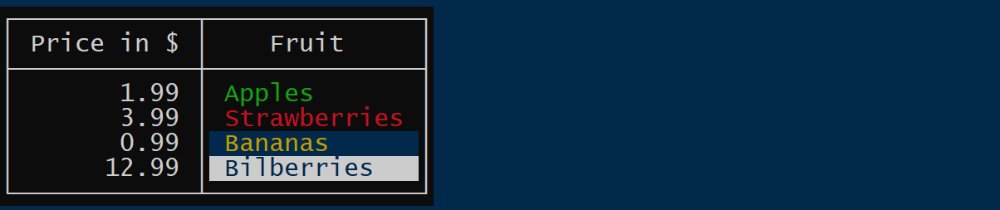
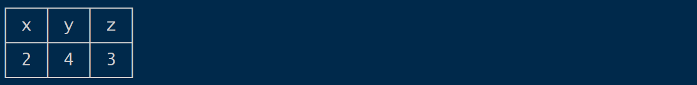

# table-string

Originally, I was looking for a replacement for `console.table()` because I missed this function in Cloudflare workers.

So `tableString()` is a function originally inspired by `console.table()` but with the following main differences:

* First, it doesn't output anything to the console, but returns a string.
* More importantly, its output looks less technical. It aims to simplify the creation of meaningful tables for CLIs. 

## Purpose

We will generate a table for this array:

```js
const data = [
  { price: 1.99, fruit: chalk.green("Apples") },
  { price: 3.99, fruit: chalk.red("Strawberries") },
  { price: 0.99, fruit: chalk.bgBlue.yellow("Bananas") },
  { price: 12.99, fruit: chalk.blue.bgWhite("Bilberries") },
],
```

### What you get without tableString
On `node.js` `console.table(data)` produces a table that looks very debug-like:



### What you might be looking for
The same structure with `tableString(data)` looks much cleaner:


### What else `tableString` can do 
By adding two parameters we can control the columns and table options: 
 

```js
tableString(data,
  [{ price: "Price in $" }, { fruit: "Fruit" }],
  {
    frameChalk: chalk.white.bgBlack(" "),
  }
);
```


## Geared for CLI output, not debugging

As I was looking into this, I noticed that the output of `console.table()` looks pretty technical. It's more appropriate for developers debugging their code than for users of a CLI expecting informative tables.

### Less technical

I've intentionally omitted some functions from `console.table()` because they give the output a more technical, debugger-like look:  
 * there is no coloring of values based on their JavaScript type
 * there are no quotes around strings or 'm' after BigInts
 * null values and values of type "function" are not rendered
 * for arrays, the index column is included only if explicitly specified
 * the index column has no header by default 
 
### More functionality

The table-string package supports more options compared to `console.table`:
* It provides full control over table headings and alignment.
* It is compatible with ANSI color sequences. For example, you can use the chalk package to colorize strings without affecting the layout. Even better, padding recognizes background colors and extends them. You can even define a chalk for the table's border.   

### Non-goals:

There are other table packages with different targets. The table-string package does not share them all. Here are explicit non-goals 

 *  No support for emojis. Currently, emojis do not seem to be well supported in monospace fonts. Emojis tend to break table spacing.
 *  No dynamic effects on TTYs based on cursor repositioning. The result of the `tableString` function is a simple string that can be printed to a text file. 

## Configuration

`tableString(data, columnOptions, tableOptions)` takes three parameters: 
1. the data to be displayed
2. options describing the order, headings and alignment of the columns
3. options that specify global characteristics of the table, such as alignment of headings or a chalk for the border.

The option are typically simple values or key-value pairs. But sometimes it is also helpful to use [JavaScript functions to compute option](#using-functions-in-options).   

### Data

In general, `tableString` is called with an array[^1]. The elements of the array are used to populate the rows of the table. Values that are not strings, numbers, or objects are ignored. Strings can contain ANSI color escapes. If they occur at the beginning or the end of the string, they will be automatically extended if the string needs to be padded to fill the column width.  

[^1]: You can also pass an object instead of an array, [see the table option `propertyCompareFunction`](#propertycomparefunction).

### Column Options

The main purpose of column options is to tell the layout which columns to show and in what order.
They are also used to specify alignments and headings of columns.

An entry of the columnOptions array defines up to 5 values for a column:
* name
* heading
* minWidth, maxWidth, width
* align
* alignHeading 
Of these values, only the `name` is mandatory.

If no column options are specified, the table shows all columns available in the underlying data. 
If column options are defined, only those columns are shown in the table.

Example: `[ {name: "firstName" }, {name: "lastName" } ]`[^2] will show these two columns in that order. 
The values are taken from the properties of the same name (from the objects that form the rows of the table).

[^2]: Or shorter: `[ "firstName", "lastName" ]`, [see shortened notation](#shortened-notation) 


##### name

The `name` selects a single data column of the table. It is the name of this column. Possible values are the property names (keys) of the objects specified as table data. These include '0', '1', ... if the values in the data object are arrays. In addition, two special column names may exist: 

* `"Values"` is the name of the column of primitive values. If the data object for the table is an array, this column contains all strings and numbers that are direct elements of this array. 
* `""` is the name of the index column. Unlike `console.table()`, this column is not included by default. To add an index column, you must explicitly specify the values for the index column [using the `index` table option](#index).  

##### heading

Sets the heading of the column. If not specified, the column name is used as the heading. 

##### minWidth

The minimal width of a column is derived from the heading and the widest values. The `width` option can be used to explicitly set a minimum width for the column.   


##### maxWidth

If set, truncates too long output in this column to _n_ characters. It is an error to set `maxWidth` < `minWidth`. 

##### width

Can be used as an abbreviation for setting `minWidth` and `maxWidth` to the same value.    

##### align

Sets the alignment for the values of the column. Possible values are `left`, `center`, and `right`. The default is `left` for most values. If no alignment is specified for the column, number values will be right aligned by default. This also affects how the heading of the column is aligned. If you want a different alignment for the column heading, use the [`alignHeading` column option](#alignHeading). By default, column headings are all center aligned. This can  be changed globally with the [`alignTableHeadings` table option](#aligntableheadings).

##### alignHeading

If the [`align` column option](#align) is defined, this will also align the heading. The option `alignHeading` allows a different alignment of the heading. Possible values are `left`, `center`, and `right`. 
The default is `center` if not overridden by the [table option `alignTableHeadings`](#aligntableheadings).

#### Shortened Notation

Often, you do not need to specify all options for a column. For these cases, two abbreviations are supported:

* The tuple `{ column: "name", heading: "Column Heading" }` can be abbreviated to `{ name: "Column Heading" }`\ 
* The `{ name: "prop2" }` object can be abbreviated to a single string "prop2".

All forms can be mixed: `[ { prop1: "Column Name" }, "prop2", { name: "prop3", align: "center" } ]` 

### Table Options

While column options refer to individual columns, there are a few options that affect the entire table: 
* alignTableHeadings 
* frameChalk
* propertyCompareFunction
* index

#### alignTableHeadings

This overrides the default "center" alignment of column headings. The `align` and `alignHeading` values for individual columns take precedence over this option.

#### frameChalk

Want an alternative color for the table's border? Just define a string value with opening and closing ANSI color escapes. 
As an example: `{ frameChalk: "\x1B[37m\x1B[40m \x1B[49m\x1B[39m"}`

#### propertyCompareFunction

Normally, the data object for `tableString()` is an array. However, you can also pass an object. The properties of this object are then used to form the rows of the table. If the order of the rows is important to you, you can specify a comparison function to sort them. By default, the properties ar sorted alphabetically. If you do not want  sorting, specify: `propertyCompareFunction: null`.  

#### index

To add an index column, define values for that column. This can look like this: `index: ["A", "B", "C"]` or `index: [...data.keys()]`. The column is named `""` (the empty string) and its heading is also `""`. You can change heading and alignment with a column option for `""`: `{ name: "", heading: "(index)", align: "right" }`.

### Using Functions in Options

The examples for [the `index` table option](#index) also include an example for a computed option value: `[...data.keys()]` computes an index from the data array. There are other examples where using functions for option values greatly simplifies configuration and improves readability. 

For example, [the table option `frameChalk`](#framechalk) could also be set with the chalk package as follows: `{ frameChalk: chalk.red.bgBlue("x") }`. Here the string itself is not important, but it should have a non-zero length. Otherwise, chalk optimizes the colors away.   

As another example, if you just want the columns to show up in alphabetical order: \
`tableString(data = [{ z: 3, y: 4, x:2 }]), [...Object.keys(data[0])].sort())` renders as
